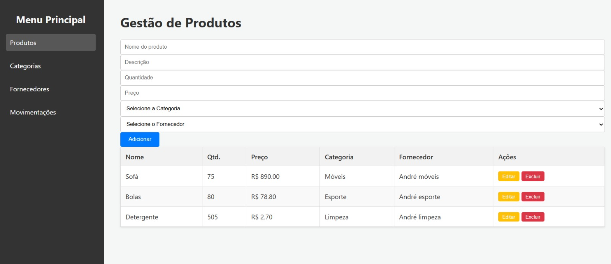
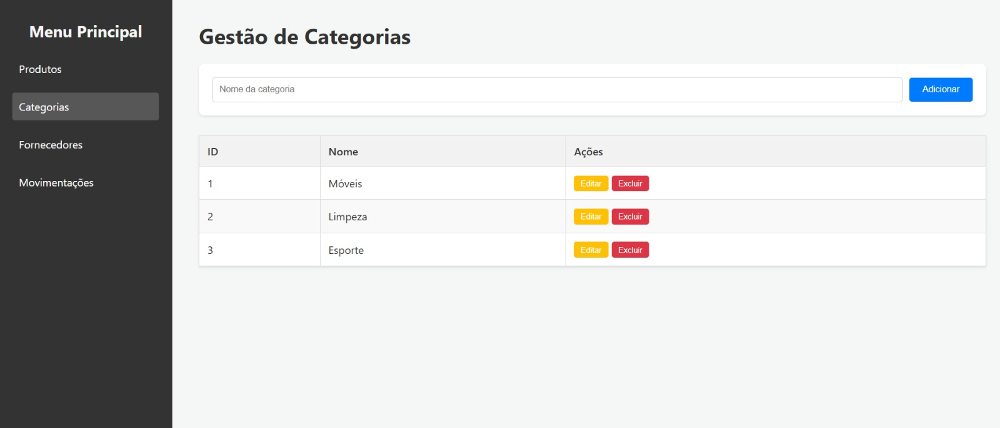
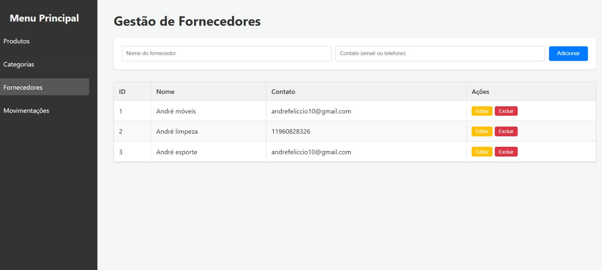
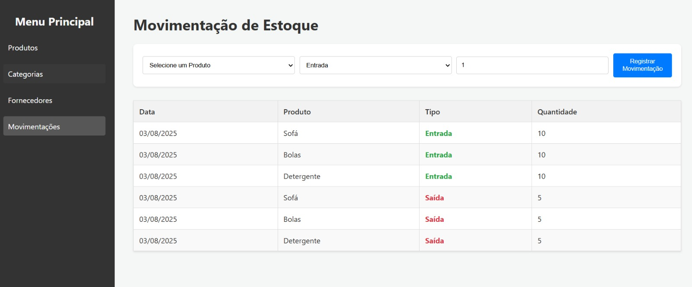
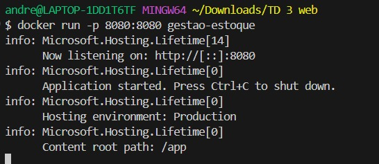

# Projeto: Web Service para Gestão de Estoque
Este repositório contém o desenvolvimento de um Web Service em C# (.NET) e integração com uma Single Page Application em React, como parte do TD3.

## Visão Geral
A aplicação consiste em um sistema de CRUD (Create, Read, Update, Delete) para 4 entidades: Produtos, Categorias, Fornecedores e Movimentações de Estoque.

Front-end: Desenvolvido com React e TypeScript.

Back-end: Web Service desenvolvido com C# e .NET, utilizando Minimal APIs e um banco de dados em memória com Entity Framework Core.

Containerização: Docker.

## A aplicação permite a gestão completa (CRUD - Criar, Ler, Atualizar, Apagar) das seguintes entidades:

* **Produtos:** Entidade principal do sistema.
* **Categorias:** Para organização dos produtos.
* **Fornecedores:** Para registo de quem fornece os produtos.
* **Movimentações:** Registo de entradas e saídas de estoque.

## Evidências de Funcionamento
Abaixo estão os prints de tela que demonstram a aplicação integrada e funcionando.

*Página de Produtos*


*Página de Categorias*


*Página de Fornecedores*


*Página de Movimentações*


*Terminal com o Contêiner Docker em Execução*


## Como Rodar o Projeto com Docker
* Pré-requisito: Ter o Docker Desktop instalado e em execução.

1. Clone este repositório.

2. Navegue até a pasta raiz do projeto no terminal.

3. Construa a imagem Docker com o comando:
```bash
docker build -t gestao-estoque .
 ```
4. Execute o container com o comando:
```bash
docker run -p 8080:8080 gestao-estoque
```
5. Acesse a aplicação no seu navegador em http://localhost:8080.